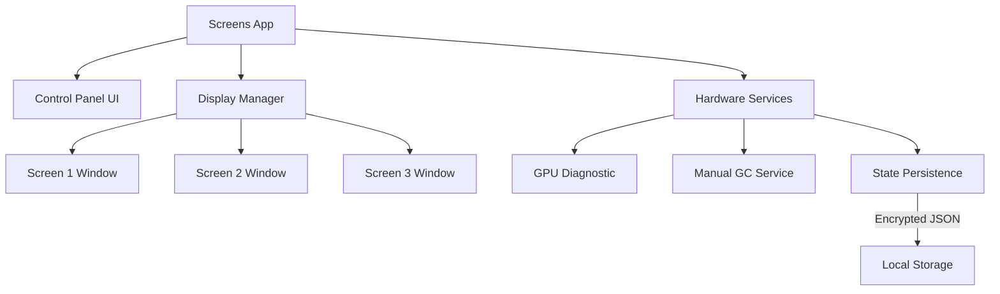

# Screens Standalone

Desktop application for Windows-based digital signage systems. **Screens** is a monolithic standalone application designed for reliable content display across multiple physical screens without external server dependencies.

## Table of Contents

- [Overview](#overview)
- [Key Features](#key-features)
- [Architecture](#architecture)
- [Technology Stack](#technology-stack)
- [Requirements](#requirements)
- [Installation & Testing](#installation--testing)
- [Project Structure](#project-structure)
- [Enterprise Readiness](#enterprise-readiness)

## Overview

**Screens** is installed on venue PCs to display and manage digital content (URLs or local media) across multiple monitors. This app functions 100% offline and is controlled entirely through its local **Control Panel**.

**Core Responsibilities:**
- Detect and manage multiple physical displays automatically.
- Provide a local interface for content management (URLs, Luckia TV, Local Media).
- Ensure high availability with automatic session restoration.
- Optimize hardware usage for low-resource environments (4GB RAM).
- Perform automatic maintenance (Garbage Collection, Cache clearing).

## Key Features

**Multi-Monitor Management**
- **Hardware-based Mapping**: Displays are mapped to physical IDs (1, 2, 3...) based on their hardware connection.
- **Kiosk Mode**: Content is displayed in borderless, full-screen windows.
- **Identify Tool**: Flash screen numbers to easily match physical monitors with the UI.

**Hardware Optimization**
- **GPU Check**: Real-time diagnostic to ensure monitors are connected to the Dedicated GPU (crucial for performance).
- **Memory Tracking**: Enhanced WeakMap-based listener registry to prevent memory leaks in event listeners.
- **Manual GC**: Periodic garbage collection for stability in 24/7 signage sessions.

**Security & Resilience**
- **AES-256-GCM Encryption**: Sensitive credentials are encrypted using machine-specific keys.
- **State Recovery**: Robust session restoration that never stores plaintext credentials in state files.
- **Network Resilience**: Active polling (5s) with automatic fallback to offline content and seamless recovery once connectivity is restored.

## Architecture



## Technology Stack

- **Framework:** Electron 38.x (Node.js 20+)
- **Security:** AES-256-GCM (Credential Encryption)
- **Testing:** Jest (Enterprise-grade coverage)
- **Storage:** Local JSON files (`state.json`, `secrets.json`)
- **Logging:** `electron-log` (Local rotation & 7-day automated cleanup)
- **Styling:** Vanilla CSS / HTML for maximum performance

## Requirements

- **Operating System:** Windows 10/11 (64-bit)
- **RAM:** Minimum 4GB (Optimized for low-memory PCs)
- **GPU:** Dedicated graphics card (Recommended for multi-screen setups)

## Installation & Testing

### Development
```bash
git clone <repository-url>
cd ScreensWeb-agent/local-agent
npm install
npm start
```

### Automated Testing
Professional test suite covering core services, encryption, and handlers.
```bash
npm test
npm run test:watch
npm run test:coverage
```

### Production Build
```bash
npm run build
```

## Project Structure

```
local-agent/
├── __tests__/             # Comprehensive Unit Test Suite (Jest)
├── config/
│   └── constants.js       # Local paths, timeouts, and hardware limits
├── handlers/
│   └── commands.js        # Core UI execution (leak-proof window management)
├── services/
│   ├── network.js         # Robus polling & automatic content recovery
│   ├── state.js           # Screen session persistence (Async I/O)
│   ├── gpuCheck.js        # Dedicated GPU connection diagnostic
│   ├── tray.js            # System tray & Control Window management
├── utils/
│   ├── encryption.js      # AES-256-GCM security service
│   └── logConfig.js       # Local logging with automated 7-day rotation
├── control.html           # Main Control Panel UI
└── package.json           # Scripts, dependencies and build config
```

## Enterprise Readiness

### Security Hardening
Credentials are never stored in the general `state.json`. Sensitive data is stored in `secrets.json` using authenticated encryption (GCM), ensuring data integrity and confidentiality.

### Long-Run Stability
Designed for 24/7 operation:
1. **Event Listener Cleanup**: Explicit tracking of window listeners avoids memory bloat.
2. **Periodic Maintenance**: Automated cache clearing and garbage collection.
3. **Log Rotation**: Automated cleanup of logs older than 7 days to prevent disk filling.

### High Test Coverage
Crucial project paths (Encryption, State, Handlers, Network) are protected by a comprehensive Jest suite, ensuring that updates don't break signage availability.
