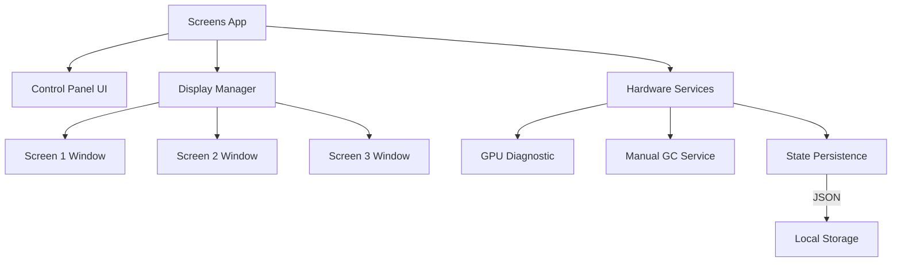

# Screens Standalone

Desktop application for Windows-based digital signage systems. **Screens** is a monolithic standalone application designed for reliable content display across multiple physical screens without external server dependencies.

## Table of Contents

- [Overview](#overview)
- [Key Features](#key-features)
- [Architecture](#architecture)
- [Technology Stack](#technology-stack)
- [Requirements](#requirements)
- [Installation](#installation)
- [Project Structure](#project-structure)
- [Maintenance & Optimizations](#maintenance--optimizations)

## Overview

**Screens** is installed on venue PCs to display and manage digital content (URLs or local media) across multiple monitors. Unlike previous versions, this app functions 100% offline and is controlled entirely through its local **Control Panel**.

**Core Responsibilities:**
- Detect and manage multiple physical displays automatically.
- Provide a local interface for content management (URLs, Luckia TV, Local Media).
- Ensure high availability with automatic session restoration.
- Optimize hardware usage for low-resource environments (4GB RAM).
- Perform automatic maintenance (Garbage Collection, Cache clearing).

## Key Features

**Multi-Monitor Management**
- **Hardware-based Mapping**: Displays are mapped to physical IDs (1, 2, 3...) based on their hardware connection.
- **Kiosk Mode**: Content is displayed in borderless, full-screen windows.
- **Identify Tool**: Flash screen numbers to easily match physical monitors with the UI.

**Hardware Optimization**
- **GPU Check**: Real-time diagnostic to ensure monitors are connected to the Dedicated GPU (crucial for performance).
- **Memory Management**: Manual Garbage Collection triggered periodically to prevent memory leaks in long-running sessions.
- **Hardware Acceleration**: Optimized Chromium flags for smooth video and animation playback.

**Local Persistence**
- **State Recovery**: If the PC restarts, Screens automatically restores the last URLs and programs assigned to each monitor.
- **Credential Storage**: Securely saves Luckia TV credentials locally.

**Local Control Panel**
- Centralized UI to send URLs to specific screens.
- Real-time status of connected monitors and GPU health.
- Quick actions: Refresh Screen, Restart App, Power Off.

## Architecture



## Technology Stack

- **Framework:** Electron 38.x (Node.js 18+)
- **Storage:** Local JSON files (`state.json`, `secrets.json`)
- **Logging:** `electron-log` (Local rotation only)
- **Styling:** Vanilla CSS / HTML for maximum performance
- **Security:** Context Isolation & Preload scripts enabled.

## Requirements

- **Operating System:** Windows 10/11 (64-bit)
- **RAM:** Minimum 4GB (Optimized for low-memory PCs)
- **GPU:** Dedicated graphics card (Recommended for multi-screen setups)

## Installation

### Development
```bash
git clone <repository-url>
cd ScreensWeb-agent/local-agent
npm install
npm start
```

### Production Build
Generates a standalone installer (`.exe`).
```bash
npm run build
```

## Project Structure

```
local-agent/
├── config/
│   └── constants.js           # Local paths, timeouts, and hardware limits
├── handlers/
│   └── commands.js            # Core UI command execution (show_url, close, refresh)
├── services/
│   ├── device.js              # Hardware ID and System commands
│   ├── gpu.js                 # GPU config and memory optimization
│   ├── gpuCheck.js            # Dedicated GPU connection diagnostic
│   ├── state.js               # Screen session persistence (JSON)
│   ├── tray.js                # System tray & Control Window management
├── utils/
│   └── logConfig.js           # Local logging & rotation
├── control.html               # Main Control Panel UI
├── fallback.html              # Offline/Error fallback page
├── identify.html              # Screen numbering overlay
├── package.json               # dependencies and build scripts
```

## Maintenance & Optimizations

### Memory Leaks
Due to the persistent nature of digital signage, the app:
1. Runs `global.gc()` every 4 hours.
2. Clears Chromium cache every hour.
3. Disables `backgroundThrottling` to ensure hidden windows or iframes keep rendering.

### GPU Protection
The built-in **GPU Diagnostic** checks if the primary display is running on the integrated Intel/AMD chip instead of the dedicated NVIDIA/AMD card, alerting the user to move the HDMI/DP cable.
